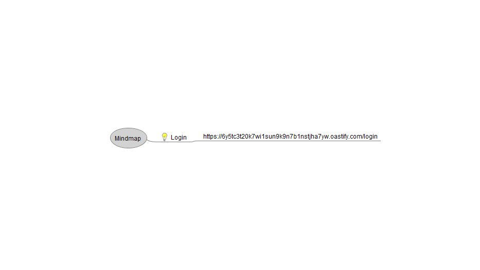
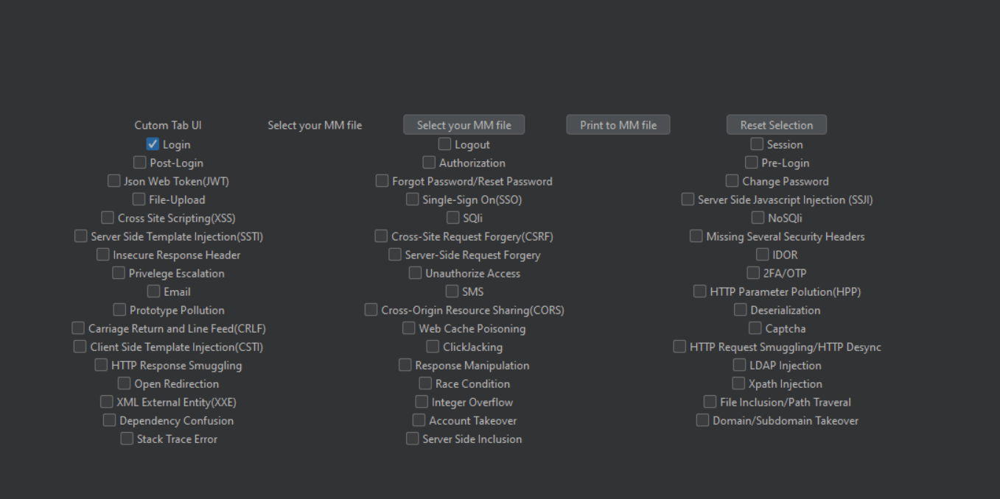
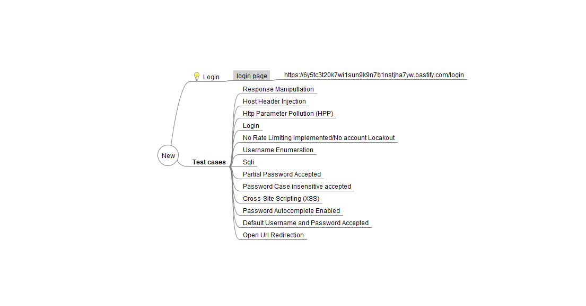

## Description

**TestCase Mapper** is a Burp Suite extension designed to streamline the process of managing test cases for web application security testing. With a single click, it allows users to effortlessly add test cases from Burp Suite to a mind map for their endpoints.

## Key Features:
- **Effortless Test Case Management**: Add test cases from Burp Suite to a mind map with a single click.
- **Organize and Visualize**: Helps security professionals organize and visualize test cases, making it easier to track and manage security testing efforts.
- **Supports Manual and Automated Tests**: Whether you're conducting manual or automated tests, TestCase Mapper enhances your workflow.
- **Efficient Endpoint Testing**: Ensures all relevant test cases are captured and organized for efficient endpoint testing.

TestCase Mapper is designed to improve the security testing process by making it easier to manage and visualize the test cases for each endpoint.

## Usage

1. **Clone the repository**:
   ```bash 
   git clone https://github.com/Parimal-shaw/TestCase-Mapper.git

2. **Open Burp Suite**:
    Go to the Extensions tab in Burp Suite.
    Click on Add and select the TestCase Mapper.py file to install the extension.

3. **Configure the extension**:
    After installation, go to the **TestCase Mapper** Tab in Burp Suite.
    Click on Select Mindmap and choose your mind map file.

4. **Create a Mindmap File**:
    Create a mindmap file and add URLs in it also do not forget to add the bulb symbol where you want to add the test case.

   

6. **Add test cases**:
    In the Burp Suite tab, click on one of the checkboxes to select the test case.

   

    Then Click on the **Print to MM** button. The test cases will be printed in the Mindmap file.

   

# Contribution

We would like to extend our heartfelt thanks to all the contributors who have helped improve this project. Your support is greatly appreciated!

## Contributor

- [Anik Jain](https://www.linkedin.com/in/anikjain0/) - Contributed with test case data required for manual web application penetration testing.

Thank you for your valuable contribution!
